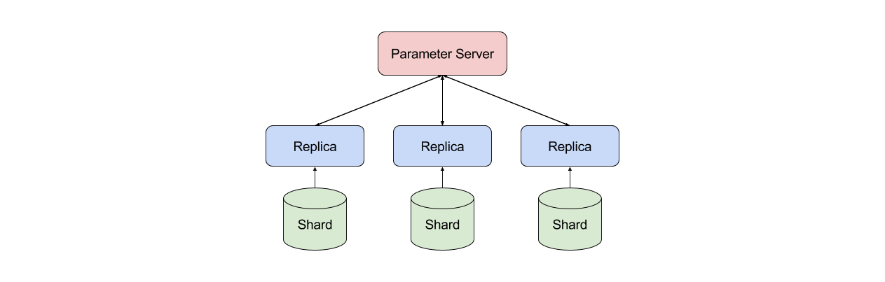

% An Introduction to Distributed Deep Learning
% Seb Arnold
% December 15, 2016

# Introduction
This blog post introduces the fundamentals of distributed deep learning and presents some real-world applications. With the democratisation of deep learning methods in the last decade, large - and small ! - companies have invested a lot of efforts into distributing the training procedure of neural networks. Their hope: drastically reduce the time to train large models on even larger datasets. Unfortunately, while every commercial product takes advantage of these techniques, it is still difficult for practitioners and researchers to use them in their everyday projects. This article aims to change that by providing a theoretical and practical overview. \newline

Last year, as an intern at Nervana Systems I was able to expand their distributed effort. During this 1 year internship, I familiarised myself with quite a number of aspects of distributed deep learning and was able to work on topics ranging from implementing efficient GPU-GPU Allreduce routines @opti-mpich to replicating Deepind's Gorila @gorila. I found this topic so fascinating that I am now researching novel techniques for distributed optimization with Prof. [Chunming Wang](http://dornsife.usc.edu/labs/msl/faculty-and-staff/), and applying them to robotic control @comp-trpo-cem with Prof. [Francisco Valero-Cuevas](http://valerolab.org/about/). 

# The Problem 
<!--
    * Introduce formalism and SGD
    * Variants of SGD
-->

## Formulation and Stochastic Gradient Descent

Let's first define the problem that we would like to solve. We are trying to train a neural network to solve a supervised task. This task could be anything from classifying images to playing Atari games or predicting the next word of a sentence. To do that, we'll rely on an algorithm - and its variants - from the mathematical optimization literature: **stochastic gradient descent**. Stochastic gradient descent (SGD) works by computing the gradient direction of the loss function we are trying to minimize with respect to the current parameters of the model. Once we know the gradient direction - aka the direction of greatest increase - we'll take a step in the opposite direction since we are trying to minimize the final error. \newline

More formally, we can represent our dataset as a distribution $\chi$ from which we sample $N$ tuples of inputs and labels $(x_i, y_i) \sim \chi$. Then, given a loss function $\mathcal{L}$ (some common choices include the [mean square error](https://en.wikipedia.org/wiki/Mean_squared_error), the [KL divergence](https://en.wikipedia.org/wiki/Kullback%E2%80%93Leibler_divergence), or the [negative log-likelihood]()) we want to find the optimal set of weights $W_{opt}$ of our deep model $F$. That is,

$$W_{opt} = \arg \min_{W} \mathbb{E}_{(x, y) \sim \chi}[\mathcal{L}(y, F(x; W))] $$

\begin{note}
In the above formulation we are not separating the dataset in train, validation, and test sets. However, you need to do it !\newline
\end{note} 

In this case, SGD will iteratively update the weights $W_t$ at timestep $t$ with $W_{t+1} = W_t - \alpha \cdot \nabla_{W_t} \mathcal{L}(y_i, F(x_i; W_t))$. Here, $\alpha$ is the learning rate and can be interpreted as the size of the step we are taking in the direction of the negative gradient. As we will see later there are algorithms that try to adaptively set the learning rate, but generally speaking it needs to be chosen by the human experimenter. \newline

One important thing to note is that in practice the gradient is evaluated over a set of samples called the minibatch. This is done by averaging the gradient of the loss for each sample in the minibatch. Taking the gradient over the minibatch helps in two aspects.

1. It can be efficiently computed by [vectorizing](https://goparallel.sourceforge.net/vectorization-feeds-need-speed/) the computations.
2. It allows us to obtain a better approximation of the *true* gradient of $\mathcal{L}(y, F(x; W))$ over $\chi$, and thus makes us converge faster.

However, a very large batch size will simply result in computational overhead since your gradient will not significantly improve. Therefore, it is usual to keep it between 32 and 1024 samples, even when our dataset contains millions of examples.

## Variants of SGD
As we will now see, several variants of the gradient descent algorithm exist. They all try to improve the quality of the gradient by including more or less sophisticated heuristics. For a more in-depth treatment, I would recommend [Sebastian Ruder's excellent blog post](http://sebastianruder.com/optimizing-gradient-descent/) and the [CS231n web page](http://cs231n.github.io/neural-networks-3/) on optimization.

### Adding Momentum
Momentum techniques simply keep track of a weighted average of previous updates, and apply it to the current one. This is akin to the momentum gained by a ball rolling downhill. In the following formulas, $\mu$ is the momentum parameter - how much previous updates we want to include in the current one.

#### Momentum
$$ v_{t+1} = \mu \cdot v_t + \alpha \cdot \nabla \mathcal{L}$$
$$ W_{t+1} = W_t - v_{t+1} $$

#### Nesterov Momentum or Accelerated Gradient @nesterov
$$ v_{t+1} = \mu \cdot (\mu \cdot v + \alpha \cdot \nabla \mathcal{L}) + \alpha \cdot \nabla \mathcal{L} $$
$$ W_{t+1} = W_t - v_{t+1} $$

Nesterov's accelerated gradient adds *momentum to the momentum* in an attempt to look ahead for what is coming. 

### Adaptive Learning Rates
Finding good learning rates can be an expensive process, and a skill often deemed closer to art or dark magic. The following techniques try to alleviate this problem by automatically setting the learning rate, sometimes on a per-parameter basis. The following descriptions are inspired by [Nervana's implementation](http://neon.nervanasys.com/index.html/optimizers.html).

\begin{note}
In the following formulas, $\epsilon$ is a constant to ensure numerical stability, and $\mu$ is the decay constant of the algorithm, how fast we decrease the learning rate as we converge.
\end{note}

#### Adagrad @adagrad
$$ s_{t+1} = s_t + (\nabla \mathcal{L})^2 $$
$$ W_{t+1} = W_t - \frac{\alpha \cdot \nabla \mathcal{L}}{\sqrt{s_{t+1} + \epsilon}}$$

#### RMSProp @rmsprop
$$ s_{t+1} = \mu \cdot s_t + (1 - \mu) \cdot (\nabla \mathcal{L})^2 $$
$$ W_{t+1} = W_t - \frac{\alpha \cdot \nabla \mathcal{L}}{\sqrt{s_{t+1} + \epsilon} + \epsilon}$$

#### Adadelta @adadelta
$$ \lambda_{t+1} = \lambda_t \cdot \mu + (1 - \mu) \cdot (\nabla \mathcal{L})^2 $$
$$ \Delta W_{t+1} = \nabla \mathcal{L} \cdot \sqrt{\frac{\delta_{t} + \epsilon}{\lambda_{t+1} + \epsilon}}$$
$$ \delta_{t+1} = \delta_t \cdot \mu + (1 - \mu) \cdot (\Delta W_{t+1})^2 $$
$$ W_{t+1} = W_t - \Delta W_{t+1}$$

#### Adam @adam
$$ m_{t+1} = m_t \cdot \beta_m + (1 - \beta_m) \cdot \nabla \mathcal{L}$$
$$ v_{t+1} = v_t \cdot \beta_v + (1 - \beta_v) \cdot (\nabla \mathcal{L})^2$$
$$ l_{t+1} = \alpha \cdot \frac{\sqrt{1 - \beta_v^p}}{1 - \beta_m^p} $$
$$ W_{t+1} = W_t - l_{t+1} \frac{m_{t+1}}{\sqrt{v_{t+1}} + \epsilon} $$

Where $p$ is the current epoch, that is 1 + the number of passes through the dataset.

### Conjugate Gradients
The following method tries to estimate the second order derivative of the loss function. This second order derivative - the Hessian $H$ - is most ably used in Newton's algorithm ($W_{t+1} = W_t - \alpha \cdot H^{-1}\nabla \mathcal{L}$) and gives extremely useful information about the curvature of the loss function. Properly estimating the Hessian (and its inverse) has been a long time challenging task since the Hessian is composed of $\lvert W \rvert^2$ terms. For more information I'd recommend these papers [@dauphin;@choromanska;@martens] and chapter 8.2 of the deep learning book @dlbook. The following description was inspired by Wright and Nocedal @optibook.

$$ p_{t+1} = \beta_{t+1} \cdot p_t - \nabla \mathcal{L} $$
$$ W_{t+1} = \alpha \cdot p_{t+1} $$

Where $\beta_{t+1}$ can be computed by the Fletcher-Rieves or Hestenes-Stiefel methods. (Notice the subscript of the gradients.)

#### Fletcher-Rieves
$$ \beta_{t+1} = \frac{\nabla_{W_{t}}\mathcal{L}^T \cdot \nabla_{W_{t}}\mathcal{L}}{\nabla_{W_{t-1}}\mathcal{L}^T \cdot \nabla_{W_{t-1}}\mathcal{L}} $$

#### Hestenes-Stiefel
$$ \beta_{t+1} = \frac{\nabla_{W_{t}}\mathcal{L}^T \cdot (\nabla_{W_{t}}\mathcal{L} - \nabla_{W_{t-1}}\mathcal{L})}{(\nabla_{W_{t}}\mathcal{L} - \nabla_{W_{t-1}}\mathcal{L})^T \cdot p_t} $$

# Beyond Sequentiallity
<!--
* Introduce sync and async, nsync
* Introduce architectures and tricks to make it faster (quantization, residuals, ...) (parameter server, mpi, etc...)
    * Tricky points
        * Implementation
        * FC, Convs, and RNNs
        * Benchmarks
* Introduce Hogwild + async begets momentum
* Distributed Synthetic Gradients
* The case of RL: Naive, Gorila, A3C, HPC Policy Gradients
-->

Let's now delve into the core of this article: distributing deep learning. As mentioned above, when training [really deep models](https://openreview.net/forum?id=B1ckMDqlg) on [really large datasets](https://github.com/openimages/dataset) we need to add more parallelism to our computations. Distributing linear algebra operations on GPUs is not enough anymore, and researchers have began to explore how to use multiple machines. That's when deep learning met *High-Performance Computing* (HPC).

## Synchronous vs Asynchronous
There are two approaches to parallelize the training of neural networks: model parallel and data parallel. Model parallel consists of "breaking" the learning model, and place those "parts" on different computational nodes. For example, we could put the first half of the layers on one GPU, and the other half on a second one. Or, split layers in their middle and assign them to separate GPUs. While appealing, this approach is rarely used in practice because of the slow communication latency between devices. Since I am not very familiar with model parallelism, I'll focus the rest of the blog post on data parallelism. \newline

Data parallelism is rather intuitive; the data is partitioned across computational devices, and each device holds a copy of the learning model - called a replica or sometimes worker. Each replica computes gradients on its shard of the data, and the gradients are combined to update the model parameters. Different ways of combining gradients lead to different algorithms and results, so let's have a closer look. 

## Synchronous Distributed SGD
In the synchronous setting, all replicas average all of their gradients at every timestep (minibatch). Doing so, we're effectively multiplying the batch size $M$ by the number of replicas $R$, so that our **overall minibatch** size is $B_G = R \cdot M$. This has several advantages.

1. The computation is completely deterministic. 
2. We can work with fairly large models and large batch sizes even on memory-limited GPUs. 
3. It's very simple to implement, and easy to debug and analyze.

This path to parallelism puts a strong emphasis on HPC, and the hardware that is in use. In fact, it will be challenging to obtain a decent speedup unless you are using industrial hardware. And even if you were using such a hardware, the choice of communication library, reduction algorithm, and other implementation details (e.g., data loading and transformation, model size, ...) will have a strong effect on the kind of performance gain you will encounter. \newline

The following pseudo-code describes synchronous distributed SGD at the replica-level, for $R$ replicas, $T$ timesteps, and $M$ global batch size.

~~~algo
\begin{algorithm}
    \caption{Synchronous SGD}
    \begin{algorithmic}
            \While{$t < T$}
                \State Get: a minibatch $(x, y) \sim \chi$ of size $M/R$.
                \State Compute: $\nabla \mathcal{L}(y, F(x; W_t))$ on local $(x, y)$.
                \State AllReduce: sum all $\nabla \mathcal{L}(y, F(x; W_t))$ across replicas into $\Delta W_t$
                \State Update: $W_{t+1} = W_t - \alpha \frac{\Delta W_t}{R}$
                \State $t = t + 1$
                \State (Optional) Synchronize: $W_{t+1}$ to avoid numerical errors
            \EndWhile
    \end{algorithmic}
\end{algorithm}
~~~

## Asynchronous Distributed SGD
The asynchronous setting is slightly more interesting from a mathematical perspective, and slightly trickier to implement in practice. Each replica will now access a shared-memory space, where the global parameters $W_t^G$ are stored. After copying the parameters in its local memory $W_t^L$, it will compute the gradients $\nabla \mathcal{L}$ and the update $\Delta W_t$ with respect to its current $W_t$. The final step is to apply $\Delta W_t^L$ to the global parameters in shared memory.

~~~algo
\begin{algorithm}
    \caption{Asynchronous SGD}
    \begin{algorithmic}
            \While{$t < T$}
                \State Get: a minibatch $(x, y) \sim \chi$ of size $M/R$.
                \State Copy: Global $W_t^G$ into local $W_t^L$.
                \State Compute: $\nabla \mathcal{L}(y, F(x; W_t^L))$ on $(x, y)$.
                \State Set: $\Delta W_t^L = \alpha  \cdot \nabla \mathcal{L}(y, F(x; W_t^L))$
                \State Update: $W_{t+1}^G = W_t^G - \Delta W_t^L$
                \State $t = t + 1$
            \EndWhile
    \end{algorithmic}
\end{algorithm}
~~~

The advantage of adding asynchrony to our training is that replicas can work at their own pace, without waiting for others to finish computing their gradients. However, this is also where the trickiness resides; we have no guarantee that while one replica is computing the gradients with respect to a set of parameters, the global parameters will not have been updated by another one. If this happens, the global parameters will be updated with **stale** gradients - gradients computed with old versions of the parameters. 

In order to counter the effect of staleness, Zhang & al. @staleness-aware suggested to divide the gradients by their staleness. By limiting the impact of very stale gradients, they are able to obtain convergence almost identical to a synchronous system. In addition, they also proposed a generalization of synchronous and asynchronous SGD named *$n$-softsync*. In this case, updates to the shared global parameters are applied in batches of $n$. Note that $n = 1$ is our asynchronous training, while $n = R$ is synchronous. A corresponding alternative named *backup workers* was suggested by Chen & al. @backup-workers in the summer of 2016. \newline

Finally, there is another view of asynchronous training that is less often explored in the litterature. Each replica executes $k$ optimization steps locally, and keeps an aggregation of the updates. Once those $k$ steps are executed, all replicas synchronize their aggregated update and apply them to the parameters before the $k$ steps. This approach is best used with [Elastic Averaging SGD](https://github.com/twitter/torch-distlearn/blob/master/lua/AllReduceEA.md) @easgd, and limits the frequency at which replicas need to communicate.

## Implementation
Now that we have a decent understanding of the mechanics of distributed deep learning, let's explore possible implementations.  

### Parameter Server vs Tree-reductions
The first decision to make is how to setup the architecture of the system. In this case, we mainly have two options: parameter server or tree-reductions. In the parameter server case, one machine is responsible for hodling and serving the global parameters to all replicas. As presented in @downpour, there can be several servers holding different parameters of the model to avoid contention, and they can themselves be hierarchically connected (eg, tree-shape in @rudra). One advantage of using parameter servers is that it's easy to implement different levels of asynchrony. \newline

However as discussed in @firecaffe, parameter servers tend to be slower and don't scale as well as tree-reduction architectures. By tree-reduction, I mean an infrastructure where collective operations are executed without a higher-level manager process. The message-passing interface (MPI) and its collective communication operations are typical examples. I particularly appreciate this setting given that it stays close to the math, and it enables a lot of engineering optimizations. For example, one could choose the reduction algorithm based on the network topology, include specialized device-to-device communication routines, and even truly take advantage of fast interconnect hardware. One caveat: I haven't (yet) come across a good asynchronous implementation based on tree-reductions.

### Layer Types
In a nutshell, all layer types can be supported with a single implementation. After the forward pass, we can compute the gradients of our model and then allreduce them. In particular, nothing special needs to be done for recurrent networks, as long as we include gradients for **all** parameters of the model. (eg, the biases, $\gamma, \beta$ for batch normalization, ...) \newline

Few aspects should impact the design of your distributed model. The main one is to (appropriately) consider convolutions. They parallelize particularly well given that they are quite compute heavy with respect to the number of parameters they contain. This is a desirable property of the network, since you want to limit the time spent in communication - that's simply overhead - as opposed to computation. In addition to being particularly good with spatially-correlated data, convolutions achieve just that since they re-multiply feature maps all over the input. More details on how to parallelize convolutional (and fully-connected) layers is available in @weird-trick. Another point to consider is using momentum-based optimizers with residuals and quantized weights. We will explore this trick in the next subsection.

### Tricks
Over the years a few tricks were engineered in order to reduce the overhead induced by communicating and synchronizing updates. I am aware of the following short and non-exhaustive list. If you know more, please let me know !

#### Device-to-Device Communication
When using GPUs, one important detail is to ensure that memory transfers are are done from device-to-device. Avoiding the transfer to host memory is not always easy, but [more](https://devblogs.nvidia.com/parallelforall/introduction-cuda-aware-mpi/) and [more](https://github.com/NVIDIA/nccl) libraries support it. Note that some GPU cards [^1] will not explicitly say that they support GPU-GPU communication, but you can still get it to work.

[^1]: I know that it is possible with GeForce 980s, 1080s, and both Maxwell and Pascal Titan Xs.

#### Overlapping Computation
If you are using neural networks like the rest of us, you backpropagate the gradients. Then a good idea is to start synchronizing the gradients of the current layer while computing the gradients of the next one. 

#### Quantized Gradients
Instead of communicating the gradients with full floating-point accuracy, we can use reduced precision. Tim Dettmers @quant-8bit suggests an algorithm to do it, while Nikko Strom @quantized quantizes gradients that are above a certain value. This gave him sparse gradients - which he compressed - and in order to keep part of the information discarded at each minibatch, he builds a *residual*. This allows even small weight updates to happen, but delays them a little.  

#### Reduction Algorithm 
As mentioned above, different reduction algorithms work best with different PICe / network topologies. (E.g., ring, butterfly, slimfly, ring-segmented) [@deepspeech; @opti-mpich; @slimfly; @ring-segmented] 

### Benchmarks
The last implementation detail I would like to mention is the way to effectively benchmark a distributed framework. There is a ferocious battle between framework developers on who is fastest and reported results might be a bit confusing. In my opinion, since we are trying to mimic the behaviour of a sequential implementation we should be looking at scalability **with a fixed overall batch size** $B_G$. That means we observe the speedup (time to convergence, time per epoch/batch, loss error) as we increase the number of computational devices, but make sure to rescale the local batch size by the number of replicas such that $B_G = R \cdot M$ stays constant across experiments.  

<!--# Recent Advancements-->

<!--## Hogwild! and Asynchronous Momentum -->

<!--## Distributed Synthetic Gradients-->

<!--## Distributed Reinforcement Learning-->

<!--# Benchmarks-->
<!--* toy problems-->
<!--* mnist -->
<!--* cifar10-->

<!--# A Live Example-->

# Conclusion
Harnessing the power of distributed deep learning is not as difficult as it seems, and can lead to some drastic performance increase. This power should be available to everyone and not just large industrial companies. In addition, having a good understanding of how parallelized learning works might allow you to take advantage of some nice properties that would be hard to replicate in a sequential setup. Finally, I hope you learned something new through this article or, at least, you have been directed to some interesting papers.

## Acknowledgements
I'd like to thank Prof. Chunming Wang, Prof. Valero-Cuevas, and Pranav Rajpurkar for comments on the article and helpful discussions. I would also like to thank Prof. Crowley for supervising the semester that allowed me to write this work.

## Citation
Please cite this article as

~~~
Arnold, Sébastien "An Introduction to Distributed Deep Learning", seba1511.com, 2016.
~~~

#### BibTeX
~~~
    @misc{arnold2016ddl,
      author = {Arnold, Sébastien},
      title = {An Introduction to Distributed Deep Learning},
      year = {2016},
      howpublished = {https://seba1511.com/dist_blog/}
    }
~~~

# References
Some of the relevant literature for this article.  

<!--http://www.benfrederickson.com/numerical-optimization/-->

<!--http://lossfunctions.tumblr.com/-->

<!--http://www.denizyuret.com/2015/03/alec-radfords-animations-for.html-->

<!--https://www.allinea.com/blog/201610/deep-learning-episode-3-supercomputer-vs-pong-->
